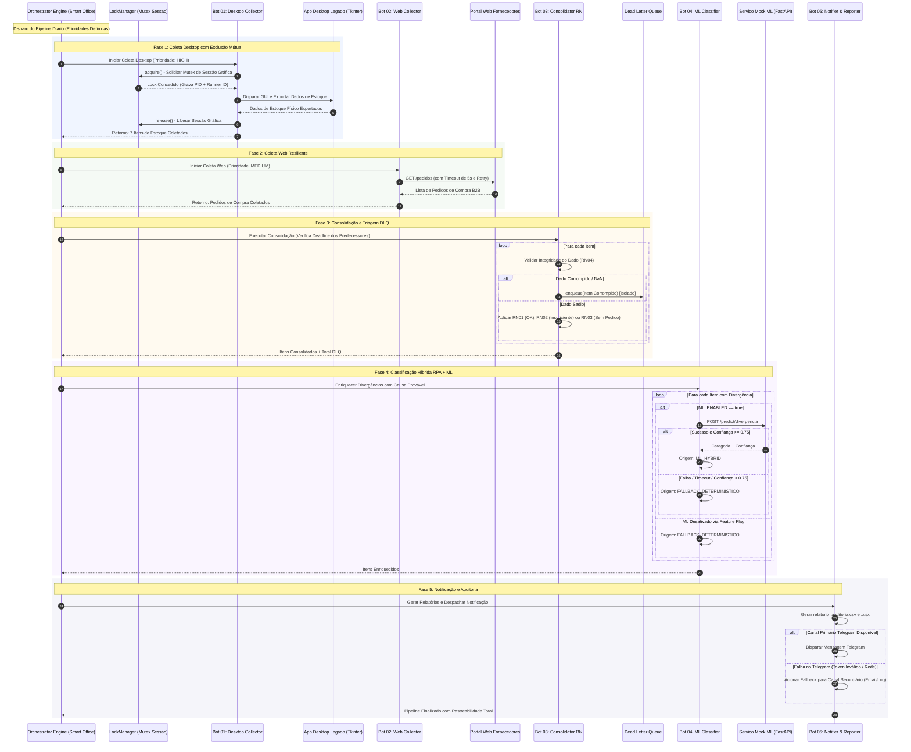
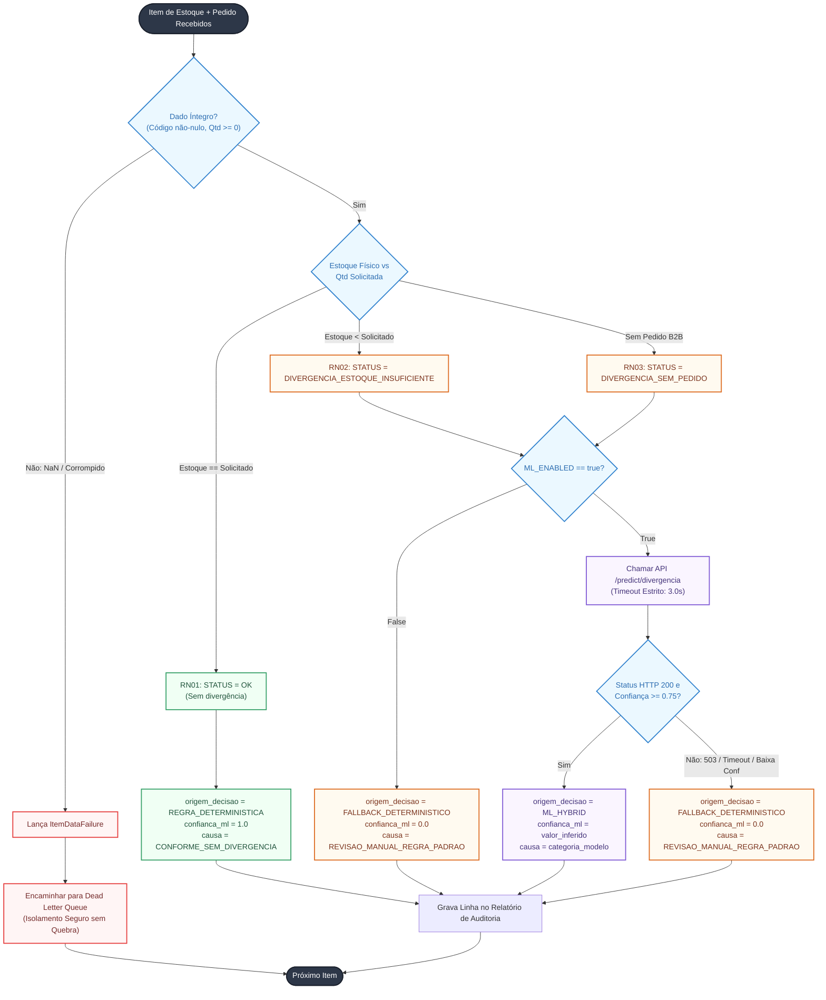
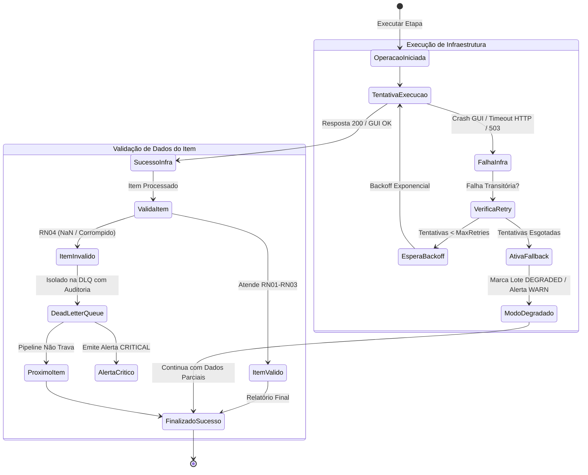
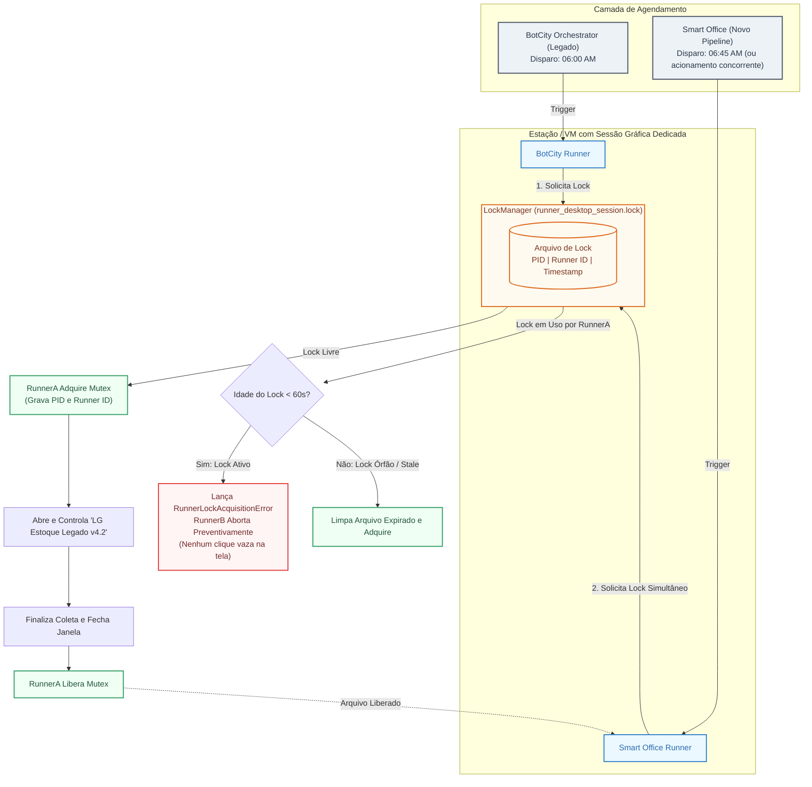

# ARQUITETURA TÉCNICA DO PIPELINE MULTI-BOT HÍBRIDO
## Diagramas Mermaid: Sequência, Decisão RPA+ML, Resiliência e Concorrência
**LG Electronics do Brasil — AX Academy | Governança The DX Way**

---

## 1. Diagrama de Sequência do Pipeline Multi-Bot Híbrido

O diagrama abaixo ilustra o ciclo de vida completo de uma execução regular, demonstrando as chamadas entre o Orquestrador, o LockManager, os 5 bots especializados e os sistemas legados/mocks.

---

## 2. Diagrama de Fluxo de Decisão RPA + ML

Ilustra o **Princípio Cardeal**: o status de negócio é 100% determinístico; o Machine Learning enriquece exclusivamente a causa provável, com degradação elegante e sem jamais interromper o processo.

---

## 3. Diagrama de Estados da Resiliência (Retry → Fallback → Dead Letter)

Demonstra a separação estrita de falhas de infraestrutura transitórias versus falhas de dados irrecuperáveis.

---

## 4. Diagrama de Coexistência de Runners na Migração (BotCity vs Smart Office)

Demonstra como o mecanismo de `LockManager` impede fisicamente a colisão de sessão de tela durante a fase de transição de orquestradores.

