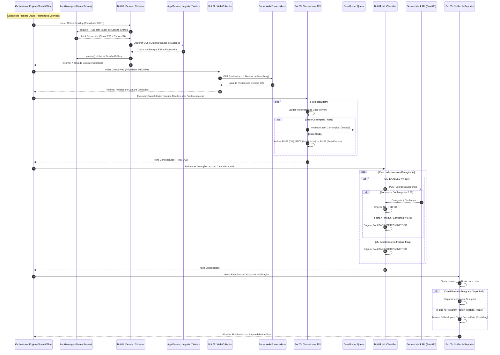
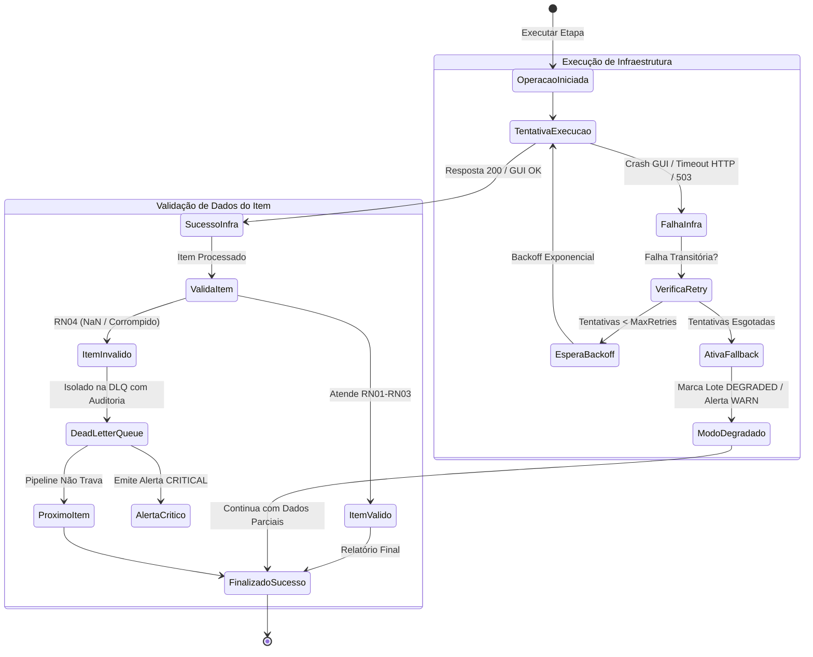
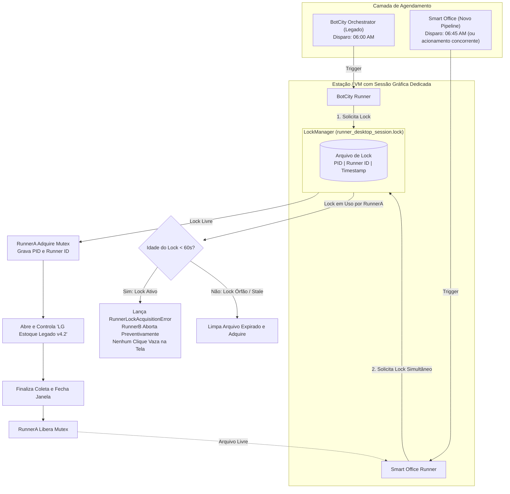

# ARQUITETURA TÉCNICA DO PIPELINE MULTI-BOT HÍBRIDO
## Diagramas Mermaid: Sequência, Decisão RPA+ML, Resiliência e Concorrência
**LG Electronics do Brasil — AX Academy | Governança The DX Way**

---

## 1. Diagrama de Sequência do Pipeline Multi-Bot Híbrido

O diagrama abaixo ilustra o ciclo de vida completo de uma execução regular, demonstrando as chamadas entre o Orquestrador, o LockManager, os 5 bots especializados e os sistemas legados/mocks.



---

## 2. Diagrama de Fluxo de Decisão RPA + ML

Ilustra o **Princípio Cardeal**: o status de negócio é 100% determinístico; o Machine Learning enriquece exclusivamente a causa provável, com degradação elegante e sem jamais interromper o processo.

```mermaid
flowchart TD
    Start([Item de Estoque + Pedido Recebidos]) --> Validacao{Dado Íntegro?\n(Código não-nulo, Qtd >= 0)}
    
    %% Validação de Dados
    Validacao -->|Não: NaN / Corrompido| DisparaDLQ[Lança ItemDataFailure]
    DisparaDLQ --> EnfileiraDLQ[Encaminhar para Dead Letter Queue\nIsolamento Seguro sem Quebra]
    EnfileiraDLQ --> EndItem([Próximo Item])

    %% Regras Determinísticas
    Validacao -->|Sim| ComparaQtd{Estoque Físico vs\nQtd Solicitada}
    ComparaQtd -->|Estoque == Solicitado| RN01[RN01: STATUS = OK\nSem divergência]
    ComparaQtd -->|Estoque < Solicitado| RN02[RN02: STATUS = DIVERGENCIA_ESTOQUE_INSUFICIENTE]
    ComparaQtd -->|Sem Pedido B2B| RN03[RN03: STATUS = DIVERGENCIA_SEM_PEDIDO]

    %% Ramificação de Decisão
    RN01 --> SemML[origem_decisao = REGRA_DETERMINISTICA\nconfianca_ml = 1.0\ncausa = CONFORME_SEM_DIVERGENCIA]
    SemML --> GeraLinhaAudit[Grava Linha no Relatório de Auditoria]

    RN02 --> AvaliaML{ML_ENABLED == true?}
    RN03 --> AvaliaML

    %% Decisão Híbrida RPA+ML
    AvaliaML -->|False| FallbackFlag[origem_decisao = FALLBACK_DETERMINISTICO\nconfianca_ml = 0.0\ncausa = REVISAO_MANUAL_REGRA_PADRAO]
    AvaliaML -->|True| ChamaML[Chamar API /predict/divergencia\nTimeout Estrito: 3.0s]

    ChamaML --> RespostaML{Status HTTP 200 e\nConfiança >= 0.75?}
    RespostaML -->|Sim| MLSucesso[origem_decisao = ML_HYBRID\nconfianca_ml = valor_inferido\ncausa = categoria_modelo]
    RespostaML -->|Não: 503 / Timeout / Baixa Conf| FallbackML[origem_decisao = FALLBACK_DETERMINISTICO\nconfianca_ml = 0.0\ncausa = REVISAO_MANUAL_REGRA_PADRAO]

    FallbackFlag --> GeraLinhaAudit
    MLSucesso --> GeraLinhaAudit
    FallbackML --> GeraLinhaAudit
    GeraLinhaAudit --> EndItem
```

---

## 3. Diagrama de Estados da Resiliência (Retry → Fallback → Dead Letter)

Demonstra a separação estrita de falhas de infraestrutura transitórias versus falhas de dados irrecuperáveis.



---

## 4. Diagrama de Coexistência de Runners na Migração (BotCity vs Smart Office)

Demonstra como o mecanismo de `LockManager` impede fisicamente a colisão de sessão de tela durante a fase de transição de orquestradores.


