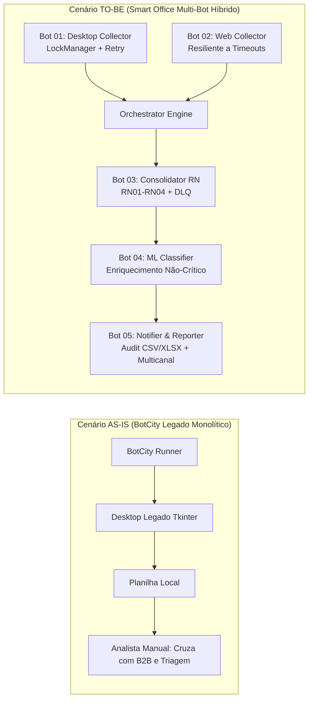

# PROCESS DEFINITION DOCUMENT (PDD)
## Capstone Hyperautomation: Pipeline Multi-Bot Híbrido de Conferência de Estoque e Pedidos
**LG Electronics do Brasil — AX Academy | Convênio IFAM / Polo de Inovação (INOVA)**  
**Governança The DX Way | Projeto Final de Curso (240h)**

---

## 1. Informações Gerais do Processo

| Campo | Descrição |
| :--- | :--- |
| **Nome do Processo** | Conferência Diária de Estoque Físico e Pedidos de Compra B2B |
| **Código do Projeto** | `RPA_EstoquePedidos_LG` |
| **Departamento Gestor** | Operações & Supply Chain (SCM) / Qualidade Fabril |
| **Orquestrador Legado** | BotCity Orchestrator (Maestro) |
| **Orquestrador Alvo** | Smart Office (LG Orchestration Platform) |
| **Tipo de Automação** | Híbrida (Desktop Windows Legado GUI + Web Portal REST/HTML + ML NLP) |
| **Periodicidade** | Diária (início às 06:00 AM) com execuções sob demanda para fechamento |
| **Tempo de Execução Manual** | ~3,5 horas diárias por analista |
| **Tempo de Execução Automatizada** | ~18 a 35 segundos por lote consolidado |

---

## 2. Visão de Negócio: AS-IS vs. TO-BE

### 2.1 Cenário AS-IS (Legado em Produção)
No cenário legado, um bot monolítico executado via **BotCity Orchestrator** acessava exclusivamente um cliente Windows legado em GUI ("LG - Controle de Estoque Legado v4.2").
- **Gargalos Operacionais**:
  1. O bot extraía apenas dados físicos de estoque; a conciliação com os pedidos de compra de fornecedores era realizada manualmente via planilhas Excel soltas.
  2. Qualquer travamento ou lentidão do cliente Windows derrubava toda a execução sem contingência.
  3. Divergências apontadas com texto livre nos campos de observação exigiam triagem 100% manual por analistas de SCM.
  4. Risco severo de concorrência gráfica caso outro usuário ou processo logasse na máquina do Runner.

### 2.2 Cenário TO-BE (Pipeline Multi-Bot Híbrido no Smart Office)
A arquitetura modernizada migra para um pipeline multi-bot modular com 5 bots segregados, orquestração por filas com prioridades e dependências com timeout, decisão RPA+ML desacoplada e resiliência ponta a ponta:

---

## 3. Especificação dos 5 Bots do Pipeline

### 3.1 Bot 01: `LG_Estoque_Desktop_V1` (Coleta Desktop)
- **Papel**: Conectar-se ao ambiente gráfico do cliente Windows ("LG - Controle de Estoque Legado v4.2"), acionar filtros e exportar o saldo físico e status de inspeção.
- **Prioridade no Orquestrador**: `HIGH` (30) — Disputa uma máquina física/virtual com sessão de desktop interativo dedicada.
- **Segurança de Concorrência**: Utiliza `LockManager` (arquivo mutex com PID e heartbeat) para garantir que apenas um Runner opere a tela por vez.
- **Padrão de Resiliência**: Decorador `@retry_with_backoff` (2 retries, fator 1.5x). Em caso de crash do software desktop, ativa **Fallback Degradado** (marcação do lote como `DEGRADED`, prosseguindo o pipeline para que os pedidos web continuem sendo tratados).

### 3.2 Bot 02: `LG_Fornecedores_Web_V1` (Coleta Web)
- **Papel**: Coletar dados de pedidos de compra em aberto diretamente do Portal B2B de Fornecedores (`/pedidos`).
- **Prioridade no Orquestrador**: `MEDIUM` (20) — Executa em background/headless ou chamadas HTTP sem disputar sessão gráfica.
- **Padrão de Resiliência**: `@retry_with_backoff` (3 retries, fator 1.5x) para lidar com instabilidades transitórias de rede e erros HTTP 5xx.

### 3.3 Bot 03: `LG_Consolidacao_RN_V1` (Consolidador Determinístico)
- **Papel**: Motor determinístico de conciliação entre o saldo de estoque físico e a quantidade solicitada em pedidos de fornecedores.
- **Controle de Dependências**: Depende estritamente do Bot 01 e Bot 02. Implementa **Deadline com Timeout Explícito** (`DEPENDENCY_TIMEOUT_SECONDS = 15.0s`). Se um precursor sofrer timeout, registra o desfecho e executa a consolidação parcial de contingência.
- **Regras de Negócio Determinísticas (RN)**:
  - `RN01`: `Estoque_Fisico == Qtd_Solicitada` $\rightarrow$ `STATUS: OK`
  - `RN02`: `Estoque_Fisico < Qtd_Solicitada` $\rightarrow$ `STATUS: DIVERGENCIA_ESTOQUE_INSUFICIENTE`
  - `RN03`: Item presente no estoque físico sem pedido correspondente $\rightarrow$ `STATUS: DIVERGENCIA_SEM_PEDIDO`
  - `RN04`: Validação de integridade do dado. Caso o item contenha código nulo, string vazia, `NaN`, ou caracteres inválidos $\rightarrow$ Lança `ItemDataFailure` e encaminha à **Dead Letter Queue (DLQ)**. O item é isolado e os demais continuam normalmente.

### 3.4 Bot 04: `LG_Classificador_ML_V1` (Enriquecimento Semântico com ML)
- **Papel**: Classificar observações em texto livre com causas prováveis (`ATRASO_FORNECEDOR`, `DIVERGENCIA_FISICA`, `ERRO_CADASTRO`).
- **Princípio Cardeal**: **O ML NUNCA decide o status de negócio (`STATUS`)**. Ele atua exclusivamente enriquecendo a coluna `causa_divergencia` de itens que já foram marcados como divergentes pelas regras determinísticas.
- **Isolamento Universal**: Todo o bloco de inferência é envolvido em `try/except` global e `CircuitBreaker`. Qualquer falha (endpoint offline, payload quebrado, HTTP 503 ou confiança $< 0.75$) direciona silenciosamente o item para:
  - `origem_decisao = "FALLBACK_DETERMINISTICO"`
  - `confianca_ml = 0.0`
  - `causa_divergencia = "REVISAO_MANUAL_REGRA_PADRAO"`

### 3.5 Bot 05: `LG_Notificador_Relatorio_V1` (Auditoria e Notificação Multicanal)
- **Papel**: Consolidar a base final, gerar os artefatos de auditoria (`relatorio_auditoria.csv` e `relatorio_auditoria.xlsx`) e despachar alertas conforme matriz de severidade.
- **Rastreabilidade**: Garante que toda linha possua `id_item`, `cod_item`, `status_regra`, `causa_divergencia`, `origem_decisao`, `confianca_ml`, `timestamp` e `runner_id`.
- **Roteamento por Severidade**:
  - `INFO`: Processamento regular diário sem anomalias.
  - `WARN`: Operação em Modo Degradado (crash do desktop com fallback, timeout de dependência, ou ML offline).
  - `CRITICAL`: Falhas críticas de infraestrutura, colisão de locks, ou itens retidos na Dead Letter Queue.
- **Fallback de Canal**:
  - **Primário**: Telegram Bot API.
  - **Secundário (Contingência)**: Em caso de falha de conexão, timeout ou token inválido do Telegram, o alerta é roteado automaticamente para canal secundário (Email SMTP simulado / Log destacado de Contingência).

---

## 4. Matriz de Dependências e Prioridades

| Bot ID | Nome da Tarefa | Prioridade | Predecessores Obrigatórios | Timeout Máximo | Comportamento em Falha |
| :--- | :--- | :---: | :---: | :---: | :--- |
| `LG_Estoque_Desktop_V1` | Coleta Estoque Legado | `HIGH` (30) | Nenhum | 20s | Retry 2x $\rightarrow$ Fallback Degradado |
| `LG_Fornecedores_Web_V1` | Coleta Pedidos Web B2B | `MEDIUM` (20) | Nenhum | 15s | Retry 3x $\rightarrow$ Falha Infra |
| `LG_Consolidacao_RN_V1` | Consolidação e RN | `MEDIUM` (20) | Bot 01, Bot 02 | 15s | Deadline Timeout $\rightarrow$ Modo Contingência |
| `LG_Classificador_ML_V1` | Enriquecimento NLP/ML | `LOW` (10) | Bot 03 | 10s | Isolado $\rightarrow$ Fallback Determinístico |
| `LG_Notificador_Relatorio_V1` | Relatórios e Alertas | `CRITICAL` (40) | Bot 04 | 15s | Fallback Telegram $\rightarrow$ Email/Log |

---

## 5. Matriz de Severidade de Notificações

| Severidade | Critério de Gatilho | Destinatários | Canal Primário | Canal Secundário | Ação Requerida da Operação |
| :---: | :--- | :--- | :---: | :---: | :--- |
| **INFO** | Processamento 100% regular com sucesso | Equipe de SCM / Qualidade | Telegram | Email | Nenhuma (ciência diária) |
| **WARN** | Falha do Bot 01 (modo degradado), timeout web ou ML offline | Analistas de RPA & SCM | Telegram | Email | Verificar causas no painel Smart Office |
| **CRITICAL** | Item na Dead Letter Queue ou colisão de Runner | Engenharia de Automação | Telegram | Email + Alerta On-Call | Analisar dados corrompidos na DLQ |

---

## 6. Governança e Auditoria (The DX Way)
- **Estrutura Segregada**: Separação clara entre `core/` (infra), `bots/` (lógica de tarefas), `mocks/` (sistemas simulados), `orchestration/` (filas e controle) e `tests/`.
- **Tipagem Estática**: Uso rigoroso de `Pydantic Settings` e `dataclasses` em todos os contratos de dados.
- **Rastreabilidade**: Nenhuma decisão é tomada de forma opaca; o log estruturado e as colunas do relatório final registram o histórico de ponta a ponta.
