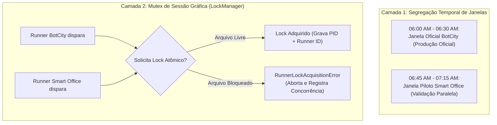

# PLANO DE MIGRAÇÃO E COEXISTÊNCIA DE ORQUESTRADORES
## Migração Controlada: BotCity Orchestrator (Maestro) → Smart Office
**LG Electronics do Brasil — AX Academy | Governança The DX Way**  
**Processo:** Conferência de Estoque e Pedidos (`RPA_EstoquePedidos_LG`)

---

## 1. Contexto e Motivação da Migração

A operação de RPA da LG Electronics está em transição estratégica do orquestrador legado **BotCity Orchestrator** para a plataforma corporativa **Smart Office** (conforme diretrizes dos Capítulos 1 e 2 do Manual de Operação do Smart Office). 

O processo de **Conferência de Estoque e Pedidos** encontra-se em produção crítica no orquestrador antigo, executando todas as manhãs. A transição não pode ser realizada por meio de uma virada brusca (*"Big Bang"*), pois a integridade do faturamento e da conferência de suprimentos fabris depende da continuidade deste processo.

Este documento formaliza:
1. A **estratégia de coexistência segura** entre os dois orquestradores.
2. O **mecanismo anti-colisão gráfica de Runners (Runner Mutex)**.
3. Os critérios de **Smoke Test e Cutover (Virada Definitiva)**.
4. O **Plano de Rollback de Emergência** com RTO (*Recovery Time Objective*) inferior a **15 minutos**.

---

## 2. Estratégia de Coexistência de Runners

### 2.1 O Desafio Crítico: Concorrência de Sessão Gráfica
O sistema legado de controle de estoque é um cliente Windows em GUI pura (Tkinter/Desktop), sem API ou versão web. Ele exige foco na tela, interação de mouse/teclado e leitura de interface gráfica. 

Se o **BotCity Runner** e o **Smart Office Runner** forem disparados no mesmo horário na mesma estação de trabalho ou máquina virtual, ocorrerá uma **colisão de sessão gráfica destrutiva**:
- Cliques e teclas enviadas por um bot atingirão as janelas manipuladas pelo outro.
- Janelas serão desminimizadas ou sobrepostas, causando erros de OCR/coordenadas.
- Dados parciais e corrompidos serão gerados nos relatórios diários.

### 2.2 Arquitetura de Coexistência: Segregação Temporal + Mutex Atômico

A coexistência adota um modelo de defesa em duas camadas:



1. **Camada 1 — Segregação de Janela Horária (Agendamento)**:
   - Durante os primeiros 5 dias de validação paralela, o agendamento oficial no **BotCity Orchestrator** ocorre às **06:00 AM**.
   - O agendamento do pipeline modernizado no **Smart Office** é programado para **06:45 AM**, garantindo que a execução oficial já tenha sido concluída.

2. **Camada 2 — Mutex de Sessão Gráfica (`LockManager`)**:
   - Mesmo havendo segregação horária, pode haver atrasos operacionais ou disparos manuais simultâneos.
   - Ambos os runners compartilham a biblioteca `core.lock_manager.LockManager`, que implementa um arquivo de lock atômico (`runner_desktop_session.lock`) com `os.O_CREAT | os.O_EXCL`.
   - Se um runner tentar abrir a tela enquanto o outro ainda estiver em execução:
     - O segundo runner é impedido imediatamente com `RunnerLockAcquisitionError`.
     - Nenhum comando de clique/tecla vaza para a tela ativa.
     - É gerado um alerta de colisão para a equipe de sustentação.

---

## 3. Critérios de Homologação e Cutover (Smoke Test de 5 Dias)

Para aprovação do desligamento definitivo do BotCity Orchestrator e transição para o Smart Office como fonte primária oficial, o pipeline deve cumprir o seguinte checklist rigoroso:

### 3.1 Checklist de Smoke Test de Corte (Cutover)

| Dia | Execução Paralela | Itens Processados | Divergências entre Orquestradores | Status da DLQ | Aprovado |
| :---: | :---: | :---: | :---: | :---: | :---: |
| **D-1** | BotCity 06:00 / Smart Office 06:45 | 100% dos lotes diários | 0 divergências no status final | 0 falhas não tratadas | [ ] |
| **D-2** | BotCity 06:00 / Smart Office 06:45 | 100% dos lotes diários | 0 divergências no status final | 0 falhas não tratadas | [ ] |
| **D-3** | BotCity 06:00 / Smart Office 06:45 | 100% dos lotes diários | 0 divergências no status final | 0 falhas não tratadas | [ ] |
| **D-4** | BotCity 06:00 / Smart Office 06:45 | 100% dos lotes diários | 0 divergências no status final | 0 falhas não tratadas | [ ] |
| **D-5** | BotCity 06:00 / Smart Office 06:45 | 100% dos lotes diários | 0 divergências no status final | 0 falhas não tratadas | [ ] |

### 3.2 Critérios de Aceite Definitivo:
- **Zero Divergência de Regra**: As decisões determinísticas (RN01, RN02, RN03) do Smart Office devem bater exatamente com as conciliações históricas.
- **Isolamento de ML Comprovado**: Em 100% das falhas simuladas de ML, a coluna `origem_decisao` foi registrada como `FALLBACK_DETERMINISTICO` sem interrupção do bot.
- **Rastreabilidade**: Auditoria com 100% dos registros preenchidos em `.xlsx` e `.csv`.

---

## 4. Plano de Rollback de Emergência (< 15 Minutos de RTO)

Caso ocorra qualquer anomalia crítica durante os primeiros dias pós-cutover no Smart Office (ex.: falha de comunicação com o portal web de fornecedores não contornada, instabilidade no cluster Smart Office ou deadlock de infraestrutura), a equipe de sustentação executará o procedimento de rollback em **menos de 15 minutos**.

### 4.1 Matriz de RTO e RPO

| Métrica | Meta Operacional | Justificativa Técnica |
| :--- | :---: | :--- |
| **RTO (Recovery Time Objective)** | **< 15 minutos** | O agendamento legado no BotCity permanece pronto para ser reativado em 3 cliques. |
| **RPO (Recovery Point Objective)** | **0 minutos** | O estoque físico é consultado em tempo real no cliente legado; não há perda de dados históricos. |

### 4.2 Procedimento Passo a Passo de Rollback

```text
[MINUTO 00:00 - IDENTIFICAÇÃO DO INCIDENTE]
 ├── Alerta CRITICAL recebido via Telegram / Email de contingência
 └── Tech Lead declara acionamento do protocolo de Rollback

[MINUTO 02:00 - DESATIVAÇÃO DO SMART OFFICE]
 ├── Acessar Console Smart Office (https://smartoffice.lge.com)
 ├── Navegar em: "Orchestration" > "Pipelines" > "RPA_EstoquePedidos_LG"
 └── Clicar em "Disable Schedule" (Desativa o disparador automático do novo pipeline)

[MINUTO 05:00 - LIMPEZA DE AMBIENTE E SESSÃO]
 ├── Acessar a VM do Runner Gráfico (VM-RPA-LG-01)
 ├── Executar script de limpeza: python -c "from core.lock_manager import LockManager; LockManager().release()"
 └── Finalizar processos órfãos: taskkill /F /IM python.exe /T (se aplicável)

[MINUTO 08:00 - REATIVAÇÃO DO BOTCITY ORCHESTRATOR LEGADO]
 ├── Acessar BotCity Maestro Console (https://lgcmd.botcity.dev)
 ├── Navegar em: "Easy Deploy / Tasks" > "Bot_Estoque_Legado"
 ├── Acessar aba "Schedules" e reativar o agendamento oficial (Toggle "Active": ON)
 └── Clicar no botão "Run Now" para executar o lote da manhã imediatamente

[MINUTO 12:00 - VALIDAÇÃO DA REVERSÃO]
 ├── Verificar log de execução no BotCity Maestro ("Task Status: FINISHED - SUCCESS")
 ├── Confirmar emissão do relatório legado na pasta compartilhada de SCM
 └── Enviar comunicado de contingência à operação via canal de sustentação

[MINUTO 14:30 - ROLLBACK FINALIZADO COM ÊXITO]
 └── RTO registrado: 14m30s (< 15 minutos)
```

---

## 5. Matriz de Responsabilidades (RACI)

| Atividade | Engenharia RPA | Sustentação L1/L2 | Operação SCM | Gestão de TI |
| :--- | :---: | :---: | :---: | :---: |
| Monitoramento da Coexistência (D-1 a D-5) | **R / A** | **C** | **I** | **I** |
| Validação Diária de Relatórios | **C** | **R** | **A** | **I** |
| Decisão de Corte (Cutover) | **C** | **C** | **A** | **A** |
| Execução do Procedimento de Rollback | **R / A** | **R** | **I** | **C** |
| Resolução de Conflitos de Runner Lock | **R / A** | **R** | **I** | **I** |

*Legenda: R = Responsável pela Execução, A = Aprovador Final, C = Consultado, I = Informado.*
